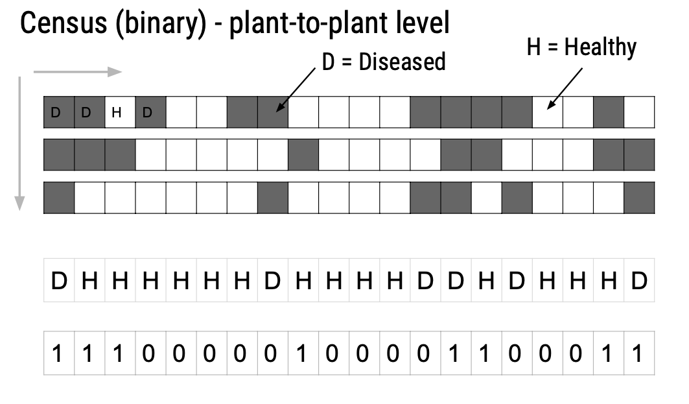
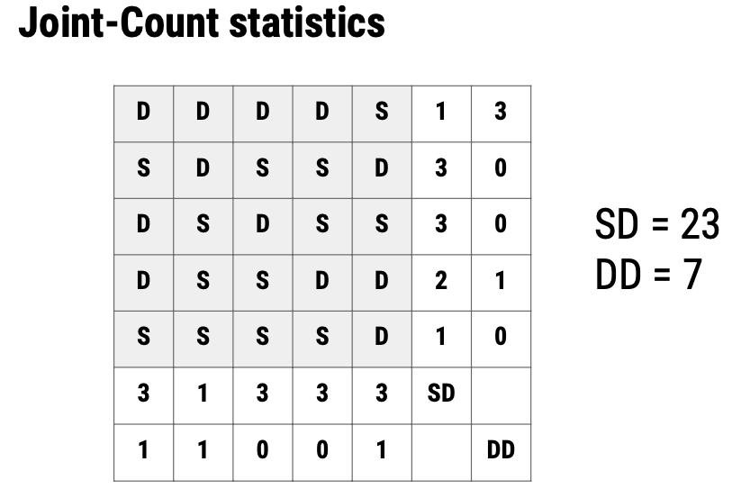

# Spatial patterns

## Introduction

A spatial disease pattern can be defined as the arrangement of diseased entities relative to each other and to the architecture of the host crop. Such arrangement is the realization of the underlying dispersal of the pathogen, from one or several sources within and/or outside the area of interest, under the influence of physical, biological and environmental factors.

The study of spatial patterns is conducted at a specific time or multiple times during the epidemic. When assessed multiple times, both spatial and temporal processes can be characterized. Because epidemics change over time, it is expected that spatial patterns are not constant but change over time as well. Usually, plant pathologists are interested in determining spatial patterns at one or various spatial scales, depending on the objective of the study. The scale of interest may be a leaf or root, plant, field, municipality, state, country or even intercontinental area. The diseased units observed may vary from lesions on a single leaf to diseased fields in a large production region.

The patterns can be classified into two main types that occur naturally: random or aggregated. The random pattern originates because the chances for the units (leaf, plant, crop) to be infected are equal and low, and are largely independent from each other. In aggregated spatial patterns, such chances are unequal and there is dependency among the units, for example, a healthy unit close to a diseased unit is at higher risk than more distant units.

A range of techniques, most based on statistical tests, can be used to detect deviations from randomness in space and the choice of the methods depends on the scale of observation. Usually, more than one test is applied for the same or different scales of interest depending on how the data are collected. Three general categories of statistical tests can be determined based on the type of data collected: position of diseased units within a row or series of rows; quadrat or plot count data; or distance among the diseased units.

## Position and status within a row

In this kind of situation, the status of each unit (usually a plant) is noted as binary. The plant is either diseased (D or 1) or healthy (H or 0). These data are usually collected in a crop row, giving rise to a series of binary data (Fig. 1).

{width="613"}

Several statistical tests can be used to detect a deviation from randomness. The most commonly used tests are runs, doublets and joint count statistics.

### Runs test

The runs test. Description.

Let's created the series of binary data representing a crop row with 20 plants, as shown in the Figure above.

```{r}
y1 <- c(1, 1, 1, 0, 0,0,0,0, 1,0,0,0,0,1,1,0,0,0,1,1)
x1 <- c(1:20) # position of each plant
z1 <- factor(1)
row1 <- data.frame(x1, y1, z1) # create a dataframe
```

We can then visualize the series:

```{r message=FALSE, warning=FALSE}
library(tidyverse)
row1 %>% 
  ggplot(aes(x1, z1, label = x1, color = factor(y1)))+
  geom_point(shape =15, size =5)+
  theme_void()+
  geom_text(vjust = 0, nudge_y = 0.05)+
  labs(color = "Status")
```

The runs test can be executed using the runs.test function of the randtests package. The null hypothesis is randomness. The test returns a P-value.

```{r}
library(randtests)
# run the runs.test function
run1 <- runs.test(row1$y1, threshold = 0.5)
run1

library(DescTools)
RunsTest(row1$y1)

```

### Doublets

The doublets test. Description.

Let's mannually produce a code to execute the doublets test.

```{r}
# matrix for each pair
S <- row1$y1
matrix <- cbind(S[-length(S)], S[-1])

# count the number of pairs
pairs <- table(data.frame(matrix))
# number of doublets
Db <- pairs[2,2]
# Total n of plants
N <- length(S) 
# N. of diseased plants
d = sum(S) # N. of diseased plants
# Expected n. of doublets
NEDb = d *((d -1)/N) ## Expected valued
# ESO standard deviation
DPDb = sqrt ( NEDb * (1 - (2 / N)))
#  Z statistics
ZDb = (Db - NEDb)/ DPDb ## Standardized values
# p-value for Z score 
pvalue <- 1-(pnorm(abs(ZDb)))
pvalue
result <- ifelse(ZDb >= 1.64, 
c("A"), c("R")) # Aggregated or Random
result

```

### Joint count

Joint count statistics. Description.

{width="594"}

Let's use the `join.count` function of the `spdep` package to perform a joint count test.

```{r,message=FALSE,warning=FALSE}

# Enter the data
S2 <- c(1,1,1,1,0,
       0,1,0,0,1,
       1,0,1,0,0,
       1,0,0,1,1,
       0,0,0,0,1)
  
library (spdep)
nb <- cell2nb(5, 5, 
              type="rook", 
              torus=FALSE)
jc_rook <- joincount.test(factor(S2), nb2listw(nb, style="B"))
jc_rook
#joincount.mc(factor(S2), nb2listw(nb, style="B"), nsim = 1000)
```
