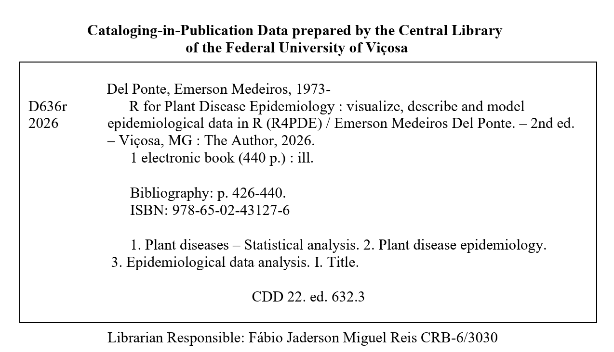

# How to cite {.unnumbered}

The author has opted for self-publishing this book to ensure its accessibility and updatability, reflecting the dynamic nature of the field and the R programming environment. Readers are encouraged to cite this work when referencing or utilizing the methodologies and insights provided in the book. Ensure the accuracy of the details while citing, especially the URL, to direct readers to the correct online source.

This is the second edition of the book. It was first published on 23 October 2023, and edition 2 was released on 4 October 2026. The book is continuously updated: the DOI identifies the archived snapshot of the edition, and the website may be newer. The ISBN of edition 2 is 978-65-02-43127-6.

A suggested citation for the whole book (please use the edition and the year you consulted):

> Del Ponte, E. M. (2026). *R for Plant Disease Epidemiology (R4PDE)* (2nd ed.). Author. ISBN 978-65-02-43127-6. DOI: [10.5281/zenodo.23145652](https://doi.org/10.5281/zenodo.23145652). [https://r4pde.net](https://r4pde.net/)

Edition 1 (first published in 2023) is archived on Zenodo (DOI: [10.5281/zenodo.23145275](https://doi.org/10.5281/zenodo.23145275)).

Two chapters were written by guest authors, and can also be cited individually:

> Lizarazo, I. A. (2026). Remote sensing. In: Del Ponte, E. M., *R for Plant Disease Epidemiology (R4PDE)*. <https://r4pde.net/data-remote-sensing.html>

> Cunniffe, N. J. (2026). Compartmental models. In: Del Ponte, E. M., *R for Plant Disease Epidemiology (R4PDE)*. <https://r4pde.net/temporal-compartmental.html>

```{=typst}
#pagebreak()
```

Cataloguing-in-Publication data prepared by the library of the Federal University of Viçosa, Brazil.

{width="555"}

