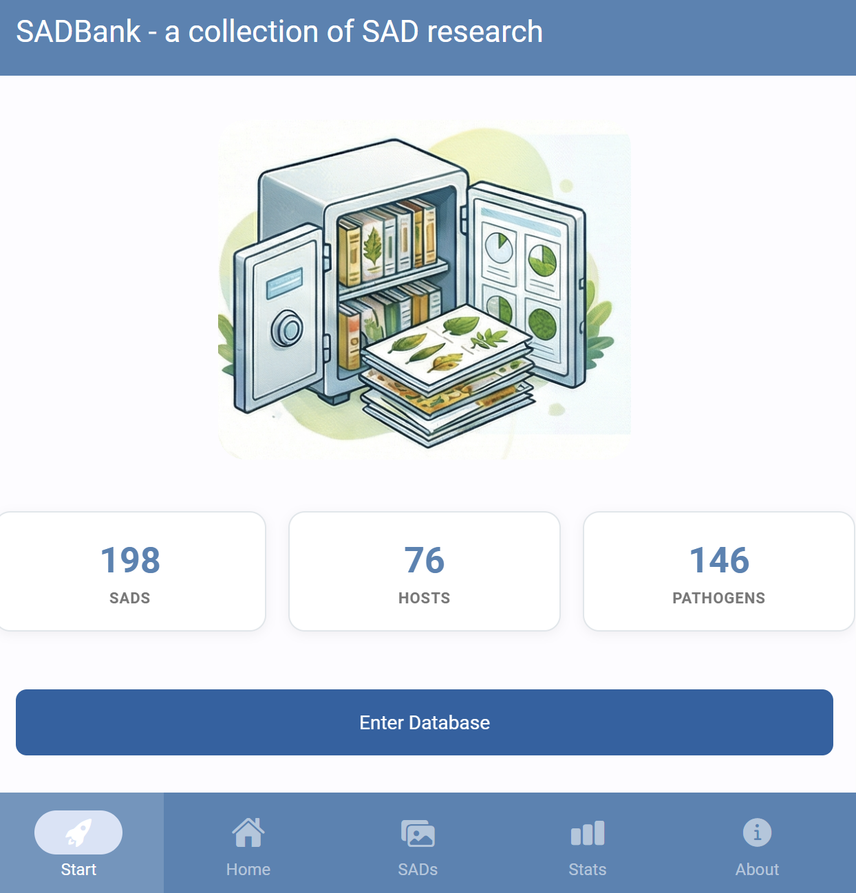

## Definitions

According to a glossary on phytopathometry [@bock2021], standard area diagram (SAD) can be defined as "*a generic term for a pictorial or graphic representation (drawing or true-color photo) of selected disease severities on plants or plant parts (leaves, fruit, flowers, etc.) generally used as an aid for more accurate visual estimation (on the percentage scale) or classification (using an ordinal scale) of severity on a specimen".*

The Standard Area Diagrams (SADs), also known as diagrammatic scales, have a long history of use in plant pathology. The concept dates back to the late 1800s when the Cobb scale was developed, featuring five diagrams depicting a range of severity levels of rust pustules on wheat leaves.

In the past 20 years, plant pathologists have leveraged advancements in image processing and analysis tools, along with insights from psychophysical and measurement sciences, to develop SADs that are realistic (e.g., true-color photographs), validated, and depict severities that maximize estimation accuracy. SADs have been created in various color formats (black or white, two-color, or true-color) and with varying incremental scales (approximated linear or logarithmic) [@delponte2017].

SADs have proven beneficial in increasing the accuracy of visual estimates, as estimating percentage areas is generally more challenging than classifying severity into ordinal classes - there are numerous possibilities on the percentage scale, compared to the finite and small number of classes in ordinal scales. A recent quantitative review confirmed that using SADs often results in improved accuracy and precision of visual estimates. However, it also identified factors related to SAD design and structure, disease symptoms, and actual severity that affected the outcomes. In particular, SADs have shown greater utility for raters who are inherently less accurate and for diseases characterized by small and numerous lesions [@delponte2022]. Here are examples of SADs in black and white, two-color, and true-color formats:

------------------------------------------------------------------------

![Actual photos of symptoms of loquat scab on fruit (left) and a SAD with eight diagrams (right). Each number represents severity as the percent area affected [@gonzález-domínguez2014]](imgs/sad-loquat.png){#fig-sad-loquat fig-align="center" width="625"}

------------------------------------------------------------------------

![SADs for Glomerella leaf spot on apple leaf. Each number represents severity as the percent area affected [@moreira2018]](imgs/sad-apple.png){#fig-sad-apple fig-align="center" width="622"}

------------------------------------------------------------------------

![SADs for soybean rust. Each number represents severity as the percent area affected [@franceschi2020]](imgs/sad-sbr.png){#fig-sad-sbr fig-align="center" width="625"}

More SADs can be found in the [SADBank](https://emdelponte.github.io/sadbank/), a curated collection of articles on SAD development and validation. Click on the image below to get access to the database.

[{#fig-sadbank fig-align="center" width="87%"}](https://emdelponte.github.io/sadbank/)

## SAD development and validation

A systematic review of the literature on SADs highlighted the most important aspects related to the development and validation of the tool [@delponte2017]. A list of best practices was proposed in the review to guide future research in the area. The most important aspects to note are:

::: callout-tip
## Best practices for SAD development

-   Sample a minimum number (e.g., n = 100) of specimens from natural epidemics representing the range of disease severity and typical symptoms observed.

-   Use reliable image analysis software to discriminate disease symptoms from healthy areas to calculate percent area affected.

-   When designing the illustrations for the SAD set, ensure that the individual diagrams are prepared realistically, whether line drawn, actual photos, or computer generated.

-   The number of diagrams should be no less than 6 and no more than 10, distributed approximately linearly, and spaced no more than 15% apart. Additional diagrams (±2) should be included between 0 and 10% severity.

-   For the validation trial, select at least 50 specimens representing the full range of actual severity and symptom patterns.

-   When selecting raters (a minimum of 15) for validation, make sure they do not have previous experience in using the SAD under evaluation.

-   Provide standard instructions on how to recognize the symptoms of the disease and how to assess severity, first without and then with the SAD.

-   Ideally repeat the assessment in time, with a 1- or 2-week interval, both without and with the aid, using the same set of raters in order to evaluate the effect of training and experience on gains in accuracy.

-   Both pre- and post-test experiment conditions should be the same to avoid any impact of distraction on accuracy of estimates during the tests.
:::

## Designing SADs in R

The diagrams used in a set have been developed using various methods and technologies, ranging from hand-drawn diagrams to actual photographs [@delponte2017]. There is an increasing trend towards using actual photos that are digitally analyzed using standard image analysis software to determine the percent area affected. With this approach, a large set of images is analyzed, and some images are chosen to represent the severities in the SAD according to the scale structure.

In R, the pliman package has a function called `sad()` which allows the automatic generation of a SAD with a pre-defined number of diagrams. Firstly, as shown in the [chapter on measuring foliar severity](data-actual-severity.qmd), the set of images to be selected needs to be analyzed using the `measure_disease()` function. Then, a SAD is automatically generated. In the function, the specimens with the smallest and highest severity will be selected for the SAD. The intermediate diagrams are sampled sequentially to achieve the pre-defined number of images after the severity has been ordered from low to high. More details of the function [here](https://tiagoolivoto.github.io/pliman/reference/sad.html).

Let's use the [same set](data-actual-severity.qmd#multiple-images) of 10 soybean leaves, as seen in that chapter, depicting the rust symptoms and create the `sbr` object.

```{r}
#| message: false
#| warning: false
library(pliman)
h <- image_import("imgs/sbr_h.png")
s <- image_import("imgs/sbr_s.png")
b <- image_import("imgs/sbr_b.png")

sbr <- measure_disease(
  pattern = "img",
  dir_original = "imgs/originals" ,
  dir_processed = "imgs/processed",
  save_image = TRUE,
  img_healthy = h,
  img_symptoms = s,
  img_background = b,
  show_original = FALSE, # set to TRUE for showing the original.
  col_background = "white", 
  verbose = FALSE,
  plot = FALSE
)
```

We are ready to run the `sad()` function to create a SAD with five diagrams side by side. The resulting SAD is in two colors by default. Set the argument `show_original` to `TRUE` for showing the original image in the SAD.

```{r}
sad(sbr, 5, ncol = 5)
```

## Analysis of SADs validation data

To evaluate the effect of SAD on accuracy components, analyze the data, preferably using concordance analysis methods ([see chapter](data-accuracy.qmd)), to fully explore which component is affected and to gain insight into the ramification of errors. Linear regression should not be used as the sole method but it could be complementary for comparison with previous literature.

Inferential methods should be used for testing hypotheses related to gain in accuracy. If parametric tests are used (paired t-test for example), make sure to check that the assumptions are not violated. Alternatively, nonparametric tests (Wilcoxon signed rank) or nonparametric bootstrapping should be used when the conditions for parametric tests are not met. More recently, a (parametric) mixed modelling framework has been used to analyze SADs validation data where raters are taken as a random effect in the model [@gonzález-domínguez2014; @franceschi2020; @pereira2020].

### Nonparametric bootstrapping of differences

Bootstrap is a resampling method where large numbers of samples of the same size are repeatedly drawn, ***with replacement***, from a single original sample. It is commonly used when the distribution of a statistic is unknown or complicated and the sample size is too small to draw a valid inference.

A bootstrap-based equivalence test procedure was first proposed as complementary to parametric (paired t-test) or non-parametric (Wilcoxon) to analyze severity estimation data in a study on the development and validation of a SADs for pecan scab [@yadav2012]. The equivalence test was used to calculate 95% confidence intervals for each statistic by bootstrapping using the percentile method (with an equivalence test, the null hypothesis is the converse of H0, i.e. the null hypothesis is non-equivalence). In that study, the test was used to compare means of the CCC statistics across raters under two conditions: 1) without versus with the SAD; and 2) experienced versus inexperienced raters.

To apply the bootstrap-based equivalence test, let's work with the CCC data for a sample of 20 raters who estimated severity of soybean rust SAD first without and then with the aid. The CCC was calculated as shown [here](data-accuracy.qmd#concordance-correlation-coefficient).

```{r}
#| warning: false

library(tidyverse)
library(r4pde)

sbr <- tibble::tribble(
  ~rater, ~aided, ~unaided,
      1,   0.97,     0.85,
      2,   0.97,     0.85,
      3,   0.95,     0.82,
      4,   0.93,     0.69,
      5,   0.97,     0.84,
      6,   0.96,     0.86,
      7,   0.98,     0.78,
      8,   0.93,     0.72,
      9,   0.94,     0.67,
     10,   0.95,     0.53,
     11,   0.94,     0.78,
     12,   0.98,     0.89,
     13,   0.96,      0.8,
     14,   0.98,     0.87,
     15,   0.98,      0.9,
     16,   0.98,     0.87,
     17,   0.98,     0.84,
     18,   0.97,     0.86,
     19,   0.98,     0.89,
     20,   0.98,     0.78
  )
```

Let's visualize the data using boxplots. Each point in the plot represents a rater.

```{r}
#| label: fig-sads-ccc-box
#| fig-cap: "Concordance correlation coefficient (CCC) of 20 raters estimating severity without (unaided) and with (aided) the standard area diagram. Each point is a rater"
#| warning: false

theme_set(theme_r4pde())
sbr |> 
  pivot_longer(2:3, names_to = "condition", values_to ="estimate") |> 
  ggplot(aes(condition, estimate))+
  geom_boxplot(outlier.colour = NA)+
  geom_jitter(width = 0.05, size = 2, alpha = 0.5)+
  theme_r4pde()+
  ylim(0.4,1)
```

To proceed with bootstrapping, we first create a new variable to hold the differences between the means of the estimates (aided minus unaided). If the 95% CI does not include zero, this means that there was a significant improvement in the statistics.

```{r}
#| label: fig-sads-diff
#| fig-cap: "Histogram of the differences in CCC between the aided and unaided conditions (aided minus unaided)"
#| warning: false

# diff of means
sbr$diff <- sbr$aided - sbr$unaided

sbr |> 
  ggplot(aes(x= diff))+
  theme_r4pde()+
  geom_histogram(bins = 10, color = "white")

```

Using the simpleboot and boot packages of R:

```{r}
#| label: fig-sads-boot
#| fig-cap: "Bootstrap distribution of the mean difference in CCC (aided minus unaided)"
library(simpleboot)
b.mean <- one.boot(sbr$diff, mean, 999)
boot::boot.ci(b.mean)
mean(b.mean$data)
hist(b.mean)
```

Using the bootstrap package:

```{r}
library(bootstrap)
b <- bootstrap(sbr$diff, 999, mean)
quantile(b$thetastar, c(.025,.975))
mean(b$thetastar)
# the bootstrap standard error is the SD of the bootstrap distribution
sd(b$thetastar)
```

Both procedures shown above have led to similar results. The 95% CIs of the differences did not include zero, so a significant improvement in accuracy can be inferred.

### Parametric and non-parametric paired sample tests

When two estimates are gathered from the same rater at different times, these data points are not independent. In such situations, a **paired sample t-test** can be utilized to test if the mean difference between two sets of observations is zero. This test requires each subject (or leaf, in our context) to be measured or estimated twice, resulting in *pairs* of observations. However, if the assumptions of the test (such as normality) are violated, a non-parametric equivalent, such as the Wilcoxon signed-rank test, also known as the **Wilcoxon test**, can be employed. This alternative is particularly useful when the data are not normally distributed.

To proceed with these tests, we first need to ascertain whether the paired differences are normally distributed. (The paired t-test does not require equal variances, because it is based on the differences.) Let's now apply the two tests to our data and compare the results.

```{r}
# normality test of the paired differences
shapiro.test(sbr$diff)

# paired t-test
t.test(sbr$aided, sbr$unaided, paired = TRUE)

# Wilcoxon test
wilcox.test(sbr$aided, sbr$unaided, paired = TRUE)
```

The Shapiro-Wilk test indicates that the differences depart from normality (P < 0.001), so the non-parametric test is the safer choice. Both tests nevertheless reject the null hypothesis of no difference between the aided and unaided conditions.

### Mixed effects modeling

Mixed models extend linear models to data in which the observations are not independent. Here each rater estimated severity twice, once without and once with the SAD, so the estimates of the same rater are correlated [@brown2021]. A mixed model has *fixed effects*, the regression parameters of interest (here, the effect of using the SAD), and *random effects*, which capture the variation among groups of observations (here, among raters).

We treat raters as a random effect because they are a sample from a larger population of possible raters, and we want conclusions that apply to that population. Accounting for the differences among raters also makes the comparison between the aided and unaided conditions more precise.


Let's start reshaping our data to the long format and assign them to a new data frame.

```{r}

sbr2 <- sbr |> 
  pivot_longer(2:3, names_to = "condition", values_to = "estimate")


```

Now we fit the mixed model using the `lmer` function of the *lme4* package. We will fit the model to the logit of the estimate because they should be bounded between zero and one. Preliminary analysis using non-transformed or log-transformed data resulted in lack of normality of residuals and heteroscedasticity (not shown).

```{r}
#| label: fig-sads-emm
#| fig-cap: "Estimated mean CCC and 95% confidence intervals for the unaided and aided conditions, from the mixed model fitted to the logit-transformed CCC"
#| warning: false
#| message: false
library(lme4) 
library(car) # for logit function
mix <- lmer(logit(estimate) ~ condition + (1 | rater), data = sbr2)

# Check model performance
library(performance)
check_normality(mix)
check_heteroscedasticity(mix)

# Check effect of condition
car::Anova(mix)

# Estimate the means for each group
library(emmeans)
em <- emmeans(mix, ~ condition, type ="response")
em

# Contrast the means
pairs(em)

# plot the means with 95% CIs
plot(em) +
  coord_flip()+
  xlim(0.7,1)+
  theme_r4pde()

```

As shown above, we can reject the null hypothesis that the means are the same between the two groups.

Alternatively, we can fit a generalized linear mixed model (GLMM), which allows the response to follow a distribution other than the normal. Because the CCC is bounded between 0 and 1, a beta distribution is a natural choice. The `glmmTMB()` function of the *glmmTMB* package fits GLMMs with a variety of distributions [@brooks2017]. We select the beta distribution with `family = beta_family()`.


```{r}
#| message: false
#| warning: false
library(glmmTMB)
mix2 <-  glmmTMB(estimate ~ condition + (1| rater), 
                 data = sbr2, 
                 family = beta_family())

```

Residual diagnostics for GLMMs fitted with `glmmTMB()` are best obtained with the *DHARMa* package, which compares standardized residuals with residuals simulated from the fitted model.


```{r}
#| label: fig-sads-dharma
#| fig-cap: "Residual diagnostics (DHARMa) of the beta mixed model fitted with glmmTMB"
#| message: false
#| warning: false
library(DHARMa)

plot(simulateResiduals(mix2))

```

The simulated residuals are uniformly distributed, which is what we expect when the model fits the data well. We can now proceed with the post hoc comparison, and we see that the results are similar to those obtained with the logit-transformed response.


```{r}
car::Anova(mix2)

library(emmeans)
em <- emmeans(mix2, ~ condition, type = "response")
em

# Contrast the means
pairs(em)
```
