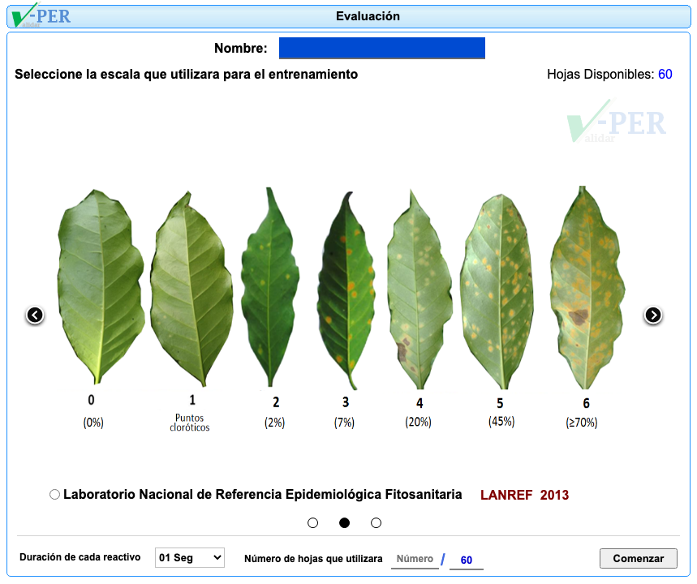
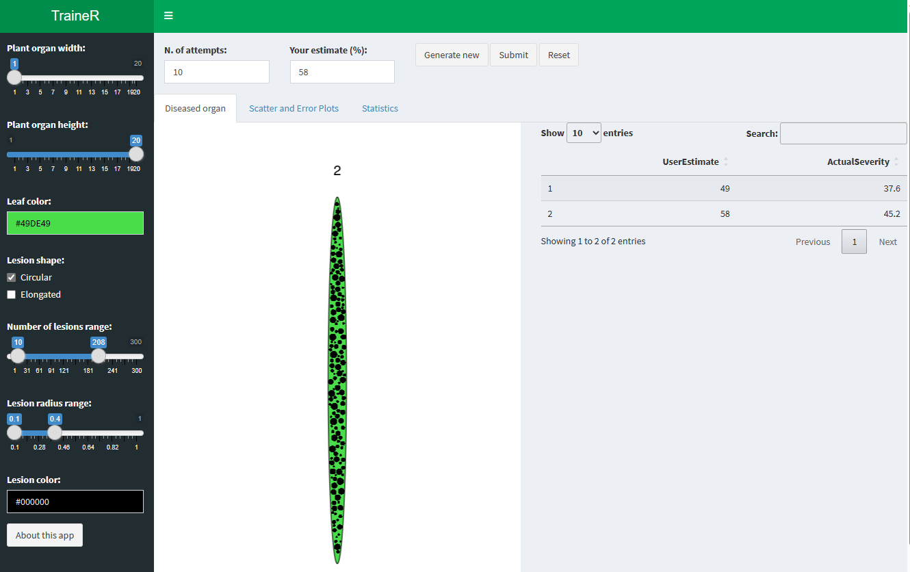
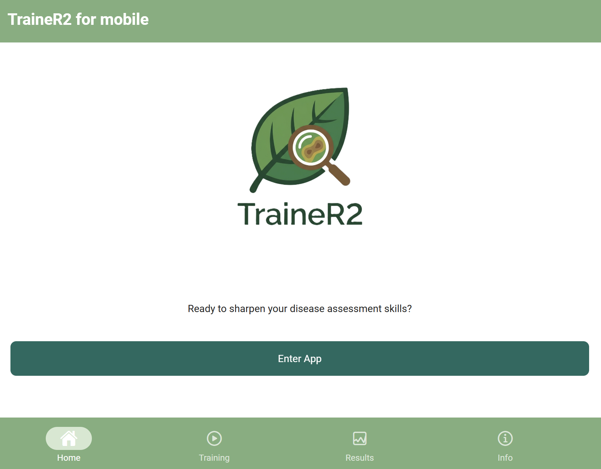

## Why train raters?

Standard area diagrams (SADs) are not the only way to improve visual estimates of disease severity. Exposing raters to a diverse set of diagrams or images with known severity values also improves their accuracy. Through repeated exposure and immediate feedback, raters calibrate their judgments against the true values and gradually build a reliable mental scale of severity. This process, called *training*, is most useful when visual estimation is the main method of assessment, and it complements other aids such as SADs.

## Software

Computerized training has a long history in plant pathology. Programs such as AREAGRAM, DISTRAIN, DISEASE.PRO, ESTIMATE, SEVERITY.PRO and COMBRO appeared in the mid-1980s, soon after personal computers became available, and ran under DOS or Windows. They showed raters computerized images with known, measured severities and gave feedback on each estimate [@bock2021a].

The benefits of training can be short-lived, because estimation skills fade without regular practice. Raters may therefore need to repeat the training before an assessment to keep their accuracy and precision.

![Selected screenshots from Severity.Pro, the disease assessment training program by Forrest W. Nutter [@madden2021].](imgs/severitypro.png){#fig-severitypro style="float:left; margin-right: 30px" width="411"}

### Online training tools

In Brazil, the "Sistema de treinamento de acuidade visual" began as a web-based system to train raters in assessing citrus canker. It now has a current version for iOS and Android, available at this [link](http://sitav.pga.uem.br/index.php?menu=app).

In Mexico, **Validar-PER** trains raters to assess the severity of coffee leaf rust using diagrammatic log-based scales. It is available online [here](http://royacafe.lanref.org.mx/ValidarPer/app/index.php).

[{#fig-validar width="430"}](http://royacafe.lanref.org.mx/ValidarPer/app/index.php)

### Training software made with R

#### TraineR

[TraineR](https://edelponte.shinyapps.io/traineR/) is a Shiny app developed by the author of this book to train users to estimate severity as the percentage area of a leaf or fruit covered by lesions.

Users first set the organ shape and color and the lesion shape, color, number and size, and the app draws an ellipsoidal diagram with these characteristics. They then choose the number of attempts and click "generate new". For each diagram, the user types an estimate of the diseased area (%), and the app records it in a table next to the actual value.

After the last attempt, the app reports the user's accuracy as Lin's concordance correlation coefficient, shows plots of the estimates against the actual values and of the estimation errors, and gives further accuracy statistics.

The app has some limitations: lesions cannot overlap, and the maximum severity is about 60%. It remains a useful educational and demonstration tool.

[{#fig-trainer width="430"}](https://edelponte.shinyapps.io/traineR/)

#### Trainer2

[Trainer2](https://delponte.shinyapps.io/traineR2/), the second generation of TraineR, uses photographs of real symptoms instead of simulated diagrams. Users estimate the percentage area affected from the photographs, which makes the training closer to field assessment.

{#fig-trainer2 width="430"}
