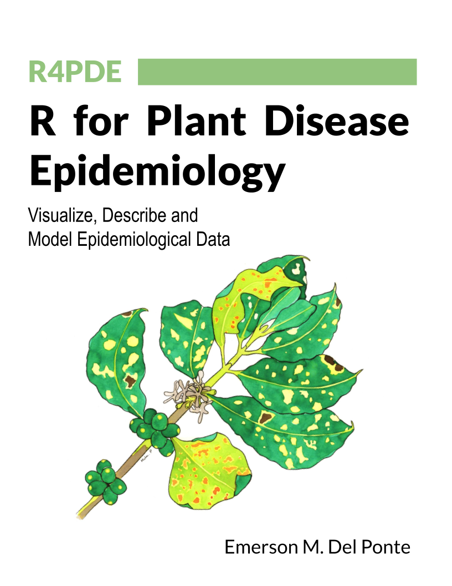

# Welcome

**R for Plant Disease Epidemiology** is a book project in the development stage. It is based on my teaching notes of a graduate course, currently **FIP 602 - Plant Disease Epidemiology**, offered every year (started in 2007 at my previous job) for students of the [Graduate Program in Plant Pathology](http://www.dfp.ufv.br/grad/) of the Universidade Federal de Viçosa.

This book is intended for those who have a minimum knowledge of R programming sing the RStudio IDE and the tidyverse ecosystem. I make use of several general or specific R packages for conducting the most common tasks related with the analysis of plant disese epidemiology data. The book is accompanied by an R package (r4pde) where dataset and some functions developed by the author can be used.
