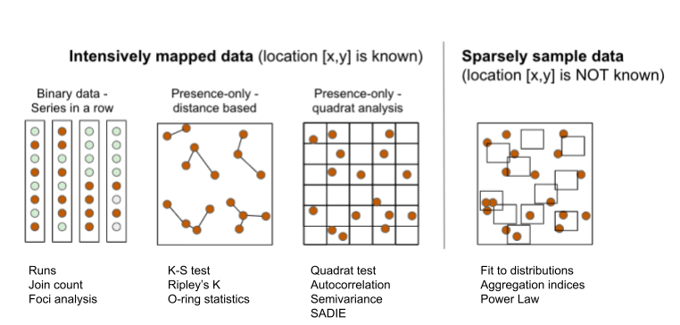
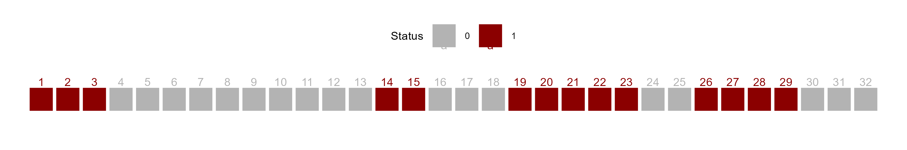

A range of techniques, most based on statistical tests, can be used to detect deviations from randomness in space. The choice of the methods depends on the question, the nature of the data and scale of observation. Usually, more than one test is applied for the same or different scales of interest depending on how the data are collected.

The several exploratory or inferential methods can be classified based on the spatial scale and type of data (binary, count, etc.) collected, but mainly if the spatial location of the unit is known (mapped) or not known (sampled). Following @madden2007, two major groups can be formed. The first group uses intensively mapped data for which the location \[x,y\] of the sampling unit is known. Examples of data include binary data (plant is infected or not infected) in planting row, point pattern (spatial arrangements of points in a 2-D space) and quadrat data (grids are superimposed on point pattern data). The second group is the sparsely sampled data in the form of count or proportion (incidence) data for which the location is not known or, if known, not taken into account in the analysis.

{#fig-spatialmethods width="649"}

## Intensively mapped

### Binary data

In this situation the individual plants are mapped, meaning that their relative positions to one another are known. It is the case when a census is used to map presence/absence data. The status of each unit (usually a plant) is noted as a binary variable. The plant is either diseased (D or 1) or non-diseased or healthy (H or 0). Several statistical tests can be used to detect a deviation from randomness. The most commonly used tests are runs, doublets and join count.

#### Runs test

A **run** is defined as a succession of *one or more* diseased (D) or healthy (H) plants, which are followed and preceded by a plant of the other disease status or no plant at all [@madden1982]. There would be few runs if there is an aggregation of diseased or healthy plants and a large number of runs for a random mixing of diseased and healthy plants.

Let's create a vector of binary (0 = non-diseased; 1 = diseased) data representing a crop row with 32 plants and assign it to `y`. For plotting purposes, we make a data frame for more complete information.

```{r}
#| warning: false
#| message: false
library(tidyverse) 
```

```{r}
y1 <- c(1,1,1,0,0,0,0,0,0,0,0,0,0,1,1,0,0,0,1,1,1,1,1,0,0,1,1,1,1,0,0,0)
x1 <- c(1:32) # position of each plant
z1 <- 1
row1 <- data.frame(x1, y1, z1) # create a dataframe
```

We can then visualize the series using ggplot and count the number of runs as 8, aided by the different colors used to identify a run.

```{r}
#| warning: false
#| message: false
library(grid)
runs2 <- row1 |>
  ggplot(aes(x1, z1, label = x1, color = factor(y1))) +
  geom_point(shape = 15, size = 10) +
  scale_x_continuous(breaks = max(z1)) +
  scale_color_manual(values = c("gray70", "darkred")) +
  geom_text(vjust = 0, nudge_y = 0.5) +
  coord_fixed() +
  ylim(0, 2.5) +
  theme_void() +
   theme(legend.position = "top")+
  labs(color = "Status")
ggsave("imgs/runs2.png", runs2, width = 12, height = 2, bg = "white")
```

{#fig-runs2}

We can obtain the number of runs and related statistics using the `oruns_test()` function of the {r4pde}.

```{r}
library(r4pde)
oruns_test(row1$y1)
```

#### Join count

In join-count statistics, two adjacent plants may be classified by the type of join that links them: D-D, H-H or H-D. The number of joins of the specified type in the orientation(s) of interest is then counted. The question is whether the observed join-count is large (or small) relative to that expected for a random pattern. The join-count statistics provide a basic measure of spatial autocorrelation. The expected number of join counts can be defined under randomness and the corresponding standard errors can be estimated after constants are calculated based on the number of rows and columns of the matrix.

Let's use the `join_count()` function of the {r4pde} package to perform a join count test. The formulations in this function apply only for a rectangular array with no missing values, with the "rook" definition of proximity, and they were all presented in the book The Study of Plant Disease Epidemics, page 261 [@chapter2007].

Let's create a series of binary data from left to right and top to bottom. The data is displayed in Fig. 9.13 in page 260 of the book [@chapter2007]. In the example, there are 5 rows and 5 columns. This is specified later to compose the matrix which is the data format for analysis.

```{r}
m1 <- c(1,0,1,1,0,
       1,1,0,0,0,
       1,0,1,0,0,
       1,0,0,1,0,
       0,1,0,1,1)
matrix1 <- matrix(m1, 5, 5, byrow = TRUE)
```

We can visualize the two-dimensional array by converting to a raster.

```{r}
#| label: fig-joincount1
#| fig-cap: "Visualization of a matrix of presence/absence data representing a disease spatial pattern"
# Convert to raster 
mapS2 <- terra::rast(matrix1)
# Convert to data frame
mapS3 <- terra::as.data.frame(mapS2, xy = TRUE)
mapS3 |>
  ggplot(aes(x, y, label = lyr.1, fill = factor(lyr.1))) +
  geom_tile(color = "white", linewidth = 0.5) +
  theme_void() +
  coord_fixed()+
  labs(fill = "Status") +
  scale_fill_manual(values = c("gray70", "darkred"))+
  theme(legend.position = "top")
```

The function `join_count()` calculates spatial statistics for a matrix based on the specifications and calculations shown in the book [@chapter2007]. It identifies patterns of aggregation for values in a binary matrix based on join count statistics. The results determine whether the observed spatial arrangement is aggregated or non-aggregated (random) based on a standard normal distribution test statistic Z-score applied separately for HD or DD sequences. For HD, Z-score lower than - 1.64 (more negative) is taken as a basis for rejection of hypothesis of randomness (P = 0.05). For DD sequences, Z-score greater than 1.64 indicates aggregation.

```{r}
library(r4pde)
join_count(matrix1)

```

In the example above, the observed count of HD sequence was larger than the expected count, so the Z-score suggests non-aggregation, or randomness. The DD sequence observed count was lower than expected count, confirming non-aggregation. Let's repeat the procedure using the second array of data shown in the book chapter, for which the result is different. In this case, there is evidence of aggregation of diseased plants, because the observed DD is greater than expected and observed HD is lower than expected. The Z-score for HD is less than -1.64 (P\< 0.05) and the Z-score for DD is greater than 1.64 (P \< 0.05).

```{r}
m2 <- c(1,1,1,0,0,
       1,1,1,0,0,
       1,1,1,0,0,
       1,1,1,0,0,
       0,0,0,0,0)
matrix2 <- matrix(m2, 5, 5, byrow = TRUE)

join_count(matrix2)
```

We can apply these tests for a real example epidemic data provided by the {r4pde} R package. Let's work with a portion of the intensively mapped data on the occurrence of gummy stem blight (GSB) of watermelon [@café-filho2010].

```{r}
#| message: false
#| warning: false
library(r4pde)
gsb <- DidymellaWatermelon
gsb 
```

The inspection of the data frame shows four variables where `dap` is the number of days after planting, `NS_col` is the north-south direction, `EW_row` is the east-west direction and `severity` is the severity in ordinal score (0-4). Let's produce a map for the 65 and 74 `dap`, but first we need to create the incidence variable based on severity.

```{r}
#| label: fig-tsw
#| fig-cap: "Incidence maps for gummy stem blight of watermelon"

gsb2 <- gsb |>
  filter(dap %in% c(65, 74)) |> 
  mutate(incidence = case_when(severity > 0 ~ 1,
                               TRUE ~ 0))

gsb2 |> 
  ggplot(aes(NS_col, EW_row, fill = factor(incidence)))+
  geom_tile(color = "white") +
  coord_fixed() +
  scale_fill_manual(values = c("gray70", "darkred")) +
  facet_wrap( ~ dap) +
  labs(fill = "Status")+
  theme_void()+
  theme(legend.position = "top")
```

Now we should check the number of rows (y) and columns (x) for further preparing the matrix for the join count statistics. The `m65` object should be in the matrix format before running the join count test.

```{r}
max(gsb2$NS_col)
max(gsb2$EW_row)

m65 <- gsb2 |> 
  filter(dap == 65) |> 
  pull(incidence) |> 
  matrix(12, 16, byrow = TRUE)

join_count(m65)

```

We can apply the join count test for 74 dap. The result shows that the pattern is now aggregated, differing from 65 dap.

```{r}
# Pull the binary sequence of time 2
m74 <- gsb2 |> 
  filter(dap == 74) |> 
  pull(incidence) |> 
  matrix(12, 16, byrow = TRUE)

join_count(m74)


```

#### Foci analysis

The Analysis of Foci Structure and Dynamics (AFSD), introduced by @nelson1996simple and further expanded by @laranjeira1998dinamica, was used in several studies on citrus diseases in Brazil. In this analysis, the data come from incidence maps where both the diseased and non-diseased trees are mapped in the 2D plane [@jesusjunior2004; @laranjeira2004].

Here is an example of an incidence map with four foci (adapted from @laranjeira1998dinamica). The data is organized in the wide format where the first column x is the index for the row and each column is the position of the plant within the row. The 0 and 1 represent the non-diseased and diseased plant, respectively.

```{r}
foci <- tibble::tribble(
           ~x, ~`1`, ~`2`, ~`3`, ~`4`, ~`5`, ~`6`, ~`7`, ~`8`, ~`9`,
           1,   0,   0,   0,   0,   0,   0,   0,   0,   0,
           2,   1,   1,   1,   0,   0,   0,   0,   1,   0,
           3,   1,   1,   1,   0,   0,   0,   1,   1,   1,
           4,   0,   1,   1,   0,   0,   0,   0,   1,   0,
           5,   0,   1,   1,   0,   0,   0,   0,   0,   0,
           6,   0,   0,   0,   1,   0,   0,   0,   0,   0,
           7,   0,   0,   0,   0,   0,   0,   0,   0,   0,
           8,   0,   0,   0,   0,   0,   0,   0,   0,   0,
           9,   0,   0,   0,   0,   0,   1,   0,   1,   0,
          10,   0,   0,   0,   0,   0,   0,   1,   0,   0,
          11,   0,   1,   0,   0,   0,   1,   0,   1,   0,
          12,   0,   0,   0,   0,   0,   0,   0,   0,   0
          )

```

Since the data frame is in the wide format, we need to reshape it to the long format using `pivot_longer` function of the *tidyr* package before plotting using *ggplot2* package.

```{r}
library(tidyr)

foci2 <- foci |> 
  pivot_longer(2:10, names_to = "y", values_to = "i")
foci2

```

Now we can make the plot.

```{r}
#| warning: false
#| message: false
#| label: fig-foci1
#| fig-cap: "Examples of foci of plant diseases - see text for description"
library(ggplot2)
foci2 |> 
  ggplot(aes(x, y, fill = factor(i)))+
  geom_tile(color = "black")+
  scale_fill_manual(values = c("grey70", "darkred"))+
  theme_void()+
  coord_fixed()+
  theme(legend.position = "none")
```

In the above plot, the upper left focus is composed of four diseased plants with a pattern of vertical and horizontal proximity to the central unit (or the Rook's case). The upper right focus, also with four diseased plants denotes a pattern of diagonal proximity to the central unit (or the Bishop's case). The lower left focus is composed of 11 diseased plants with 5 rows and 4 columns occupied by the focus; the shape index of the focus (SIF) is 1.25 and the compactness index of the focus (CIF) is 0.55. The lower right is a single-unit focus.

In this analysis, several statistics can be summarized, both at the single focus and averaging across all foci in the area, including:

-   Number of foci (NF) and number of single-plant foci (NSF)

-   To compare maps with different number of plants, NF and NSF can be normalized to 1000 plants as NF1000 and NSF1000

-   Number of plants in each focus i (NPFi)

-   Maximum number of rows of the focus i (rfi) and maximum number of columns of the focus i (cfi)

-   Mean shape index of foci (meanSIF = \[∑(rfi / cfi)\]/NF), where SIF values equal to 1.0 indicate isodiametrical foci; values greater than 1.0 indicate foci with greater length in the direction between the planting rows and values less than 1 indicate foci with greater length in the direction of the planting row.

-   Mean compactness index of foci (meanCIF = \[∑(NPFi/rfi\*cfi)\]/NF), where CIF values close to 1.0 indicate more compact foci, that is, greater aggregation and proximity among all the plants belonging to the focus

We can obtain the above-mentioned foci statistics using the `AFSD` function of the *r4pde* package. Let's calculate for the foci2 dataset already loaded, but first we need to check whether all variables are numeric or integer.

```{r}
#| warning: false
#| message: false
str(foci2) # y was not numeric
foci2$y <- as.integer(foci2$y) # transform to numeric

library(r4pde)
result_foci <- AFSD(foci2)
  
```

The AFSD function returns a list of three data frames. The first is summary statistics of this analysis, together with the disease incidence (DIS_INC), for the data frame in analysis.

```{r}
knitr::kable(result_foci[[1]])
```

The second object in the list is a data frame with statistics at the focus level, including the number of rows and columns occupied by each focus as well as the two indices for each focus: shape and compactness.

```{r}
knitr::kable(result_foci[[2]])
```

The third object is the original data frame amended with the id for each focus which can be plotted and labelled (the focus ID) using the `plot_AFSD()` function.

```{r}
foci_data <- result_foci[[3]]
foci_data
```

The plot shows the ID for each focus.

```{r}
plot_AFSD(foci_data)+
  theme_void()
  
  
```

We will now analyze the gummy stem blight dataset again focusing on 65 and 74 dap. We first need to prepare the data for the analysis by getting the x, y and i vectors in the dataframe.

```{r}
#| warning: false
#| message: false

library(r4pde)
gsb65 <- DidymellaWatermelon |> 
  filter(dap %in% c(65)) |> 
  mutate(incidence = case_when(severity > 0 ~ 1,
                               TRUE ~ 0)) |> 
  select(EW_row, NS_col, incidence) |> 
  rename(x = EW_row, y = NS_col, i = incidence)
```

Now we can run the AFSD function and obtain the statistics.

```{r}

result_df1 <- AFSD(gsb65)

knitr::kable(result_df1[[1]])
```

This analysis is usually applied to multiple maps and the statistics are visually related to the incidence in the area in a scatter plot. Let's calculate the statistics for the two dap. We can split it by dap before applying the function. We can do it using the `map` function of the *purrr* package.

```{r}
library(purrr)
gsb65_74 <- DidymellaWatermelon |> 
  filter(dap %in% c(65, 74)) |> 
  mutate(incidence = case_when(severity > 0 ~ 1,
                               TRUE ~ 0)) |> 
  select(dap, EW_row, NS_col, incidence) |> 
  rename(dap = dap, x = EW_row, y = NS_col, i = incidence)

# Split the dataframe by 'time'
df_split <- split(gsb65_74, gsb65_74$dap)

# Apply the AFSD function to each split dataframe
results <- map(df_split, AFSD)


```

We can check the summary results for time 2 and time 3.

```{r}
time65 <- data.frame(results[[1]][1])
knitr::kable(time65)

time74 <- data.frame(results[[2]][1])
knitr::kable(time74)

# Plot the results to see the two foci in time 1
plot_AFSD(results[[1]][[3]])+
  theme_void()+
  coord_fixed()

# Plot time 2
plot_AFSD(results[[2]][[3]])+
  theme_void()+
  coord_fixed()


```

### Point pattern analysis

Point pattern analysis studies the arrangement of points in a two-dimensional space. In the simplest case each point is the location of a diseased plant, and the pattern is a map of these locations. A map (a scatter plot with equally scaled axes) gives a first impression, but we need quantitative methods to decide whether the points are random, clustered (closer together than expected by chance) or regular (more evenly spaced than expected by chance). Each of these patterns points to different processes behind the epidemic.


Let's work with two simulated datasets that were originally generated to produce a random or an aggregated (clustered) pattern.

```{r}
#| warning: false
#| message: false

library(r4pde)
rand <- SpatialRandom
aggr <- SpatialAggregated
```

Let's produce a 2-D map for each data frame.

```{r}
#| warning: false
#| message: false
prand <- rand |> 
  ggplot(aes(x, y))+
  geom_point()+
  scale_color_manual(values = c("black", NA))+
  coord_fixed()+
  coord_flip()+
   theme_r4pde(font_size = 12)+
  theme(legend.position = "none")+
  labs (title = "Random", 
        x = "Latitude",
        y = "Longitude",
        caption = "Source: r4pde R package")

paggr <- aggr |> 
  ggplot(aes(x, y))+
  geom_point()+
  scale_color_manual(values = c("black", NA))+
  coord_fixed()+
  coord_flip()+
  theme_r4pde(font_size = 12)+
  theme(legend.position = "none")+
  labs (title = "Aggregated", 
        x = "Latitude",
        y = "Longitude",
        caption = "Source: r4pde R package")

library(patchwork)
prand | paggr
```

#### Quadrat count

In the Quadrat Count method, the study region is divided into a regular grid of smaller, equally-sized rectangular or square subregions known as quadrats. For each quadrat, the number of points falling inside it is counted. If the points are uniformly and independently distributed across the region (i.e., random), then the number of points in each quadrat should follow a Poisson distribution. If the variance of the counts is roughly equal to the mean of the counts, then the pattern is considered to be random. If the variance is greater than the mean, it suggests that the pattern is aggregated or clumped.

Using the {spatstat} package, we first need to create a ppp object which represents a point pattern. This is the primary object type in spatstat for point patterns.

```{r}
#| warning: false
#| message: false

library(spatstat)

### Create rectangular window around the points
window_rand <- bounding.box.xy(rand$x, rand$y)

# create the point pattern object
ppp_rand <- ppp(rand$x, rand$y, window_rand)
plot(ppp_rand)
```

Using the `quadratcount` function, we can divide the study region into a grid and count the number of points in each cell:

```{r}
## Quadrat count 8 x 8
qq <- quadratcount(ppp_rand,8,8, keepempty = TRUE) 

# plot the quadrat count
plot(qq)
```

To determine whether the observed distribution of points is consistent with a random Poisson process, we can use the `quadrat.test` function:

```{r}
# Quadrat test
qt <- quadrat.test(qq, alternative="clustered", method="M")
qt
```

The result will give a Chi-squared statistic and a p-value. If the p-value is very low, then the pattern is likely not random. Keep in mind that the choice of the number and size of quadrats can affect the results. It's often helpful to try a few different configurations to ensure robust conclusions.

Let's repeat this procedure for the situation of aggregated data.

```{r}
#| warning: false
#| message: false

### Create a rectangular window around the points 
window_aggr <- bounding.box.xy(aggr$x, aggr$y)

# create the point pattern object
ppp_aggr <- ppp(aggr$x, aggr$y, window_aggr)
plot(ppp_aggr)

## Quadrat count 8 x 8
qq_aggr <- quadratcount(ppp_aggr,8,8, keepempty=TRUE) 

# plot the quadrat count
plot(qq_aggr)

# Quadrat test
qt_aggr <- quadrat.test(qq_aggr, alternative="clustered", method="M")
qt_aggr


```

#### Spatial KS test

The spatial Kolmogorov-Smirnov (KS) test compares the distribution of a spatial covariate at the observed points with the distribution expected if the points were completely spatially random (CSR) [@baddeley2005]. If the points tend to lie where the covariate takes particular values (for example, low elevation or close to a field edge), the test rejects CSR.

The covariate can be any spatially varying quantity that might influence the process, such as elevation, soil quality or distance to a feature. Here we use the coordinates themselves as covariates, so the test asks whether the distribution of the x-coordinates, the y-coordinates, or a combination of both, differs from what is expected under CSR.


Let's test for the aggregated data.

```{r}
#| warning: false
#| message: false

# y as covariate
ks_y <- cdf.test(ppp_aggr, test="ks", "y", jitter=FALSE)
ks_y
plot(ks_y)

# x as covariate
ks_x <- cdf.test(ppp_aggr, test="ks", "x", jitter=FALSE)
ks_x
plot(ks_x)


# x and y as covariates
fun <- function(x,y){2* x + y}
ks_xy <- cdf.test(ppp_aggr, test="ks", fun, jitter=FALSE)
ks_xy
plot(ks_xy)

```

The tests based on the x- or y-coordinate alone do not clearly reject complete spatial randomness at the 5% level (P = 0.051 and P = 0.25), but the test based on the combined covariate does (P = 0.002). We therefore have evidence against the null hypothesis of complete spatial randomness.

#### Distance based

##### Ripley's K

A spatial point process is a set of irregularly distributed locations in a region, assumed to be generated by a stochastic mechanism. Ripley's K-function, $K(r)$, describes the process at all distances at once. Assuming a constant intensity of points, $K(r)$ is the expected number of further points within distance $r$ of an arbitrary point, divided by the intensity. For diseased trees in a plantation, it answers the question: how many other diseased trees do we expect within distance $r$ of a diseased tree chosen at random?

To interpret the estimated function:

1.  **Random pattern**: $K(r)$ follows the theoretical curve for complete spatial randomness, $K(r) = \pi r^2$.

2.  **Clustered pattern**: $K(r)$ lies above the theoretical curve, because points have more neighbors than expected by chance.

3.  **Regular pattern**: $K(r)$ lies below the theoretical curve, because points have fewer neighbors than expected by chance.


Let's use the `Kest` function of the spatstat package to obtain *K(r)*.

```{r}
#| warning: false
#| message: false


k_rand <- Kest(ppp_rand)
plot(k_rand)

k_aggr <- Kest(ppp_aggr)
plot(k_aggr)

```

The `envelope` function performs simulations and computes envelopes of a summary statistic based on the simulations. The envelope can be used to assess the goodness-of-fit of a point process model to point pattern data [@baddeley2014]. Let's simulate the envelope and plot the values using ggplot. Because observed *K(r)* (solid line) lies outside the simulation envelope, aggregation was detected.

```{r}
#| label: fig-kest-envelope
#| fig-cap: "Estimated K(r) of the aggregated pattern (solid line) and the simulation envelope under complete spatial randomness (shaded area); the dashed line is the theoretical K(r)"
ke <- envelope(ppp_aggr, fun = Kest)
data.frame(ke) |> 
  ggplot(aes(r, theo))+
  geom_line(linetype =2)+
  geom_line(aes(r, obs))+
  geom_ribbon(aes(ymin = lo, ymax = hi),
              fill = "steelblue", alpha = 0.5)+
  labs(y = "K(r)", x = "r")+
  theme_r4pde(font_size = 16)
```

`mad.test` performs the 'global' or 'Maximum Absolute Deviation' test described by Ripley (1977, 1981). See [@baddeley2014]. This performs hypothesis tests for goodness-of-fit of a point pattern data set to a point process model, based on Monte Carlo simulation from the model.

```{r}
# Maximum absolute deviation test
mad.test(ppp_aggr, Kest)
mad.test(ppp_rand, Kest)

```

##### O-ring statistics

The O-ring statistic estimates the average density of points in a ring of radius $r$ around the points of a pattern, so it shows at which distances points are more or less frequent than expected [@wiegand2004]. In the univariate form used here the rings are placed around every point of a single pattern. In the bivariate form the rings are placed around points of one type and the points of a second type are counted.

The statistic is interpreted relative to the intensity of the pattern, which is the value expected under CSR:

1.  **Random pattern**: $O(r)$ is flat and close to the intensity at all distances.

2.  **Aggregation**: $O(r)$ is above the intensity at short distances and decreases toward it as $r$ increases, because points are surrounded by more neighbors than expected.

3.  **Regularity**: $O(r)$ is below the intensity at short distances and increases toward it as $r$ increases.

As with $K(r)$, a simulation envelope under CSR is used for inference: if the observed statistic lies inside the envelope, the pattern is consistent with randomness, and if it lies outside, it is not.


In R, the O-ring statistic is $O(r) = \lambda \, g(r)$, the intensity $\lambda$ of the pattern multiplied by the pair correlation function $g(r)$. The *onpoint* package provides a fast estimate of $g(r)$ with `pcf_fast()` (older versions of the package had a function called `estimate_o_ring()`, which we define here as a small wrapper). We will use the point pattern objects `ppp_rand` and `ppp_aggr` created in the previous examples

```{r}
#| warning: false
#| message: false

library(onpoint)

# O-ring statistic: intensity x pair correlation function
estimate_o_ring <- function(X, ...) {
  intensity(X) * pcf_fast(X, ...)
}

plot(estimate_o_ring(ppp_rand))
plot(estimate_o_ring(ppp_aggr))


```

The function can be used in combination with `spatstat`'s `envelope()` function.

```{r}
oring_envelope <- envelope(ppp_aggr, fun = estimate_o_ring, nsim = 199, verbose = FALSE)
plot(oring_envelope)
```

To plot simulation envelopes using quantum plots [@esser2014], just pass an `envelope` object as input to [`plot_quantums()`](https://r-spatialecology.github.io/onpoint/reference/plot_quantums.html).

```{r}
plot_quantums(oring_envelope, ylab = "O-ring")+
  theme_r4pde()
```

### Grouped data

If the data are intensively mapped, meaning that the spatial locations of the sampling units are known, we are not limited to analyze presence/absence (incidence) only data at the unit level. The sampling units may be quadrats where the total number of plants and the number of disease plants (or number of pathogen propagules) are known. Alternatively, it could be a continuous measure of severity. The question here, similar to the previous section, is whether a plant being diseased makes it more (or less) likely that neighboring plants will be diseased. If that is the case, diseased plants are exhibiting spatial autocorrelation. The most common methods are:

-   Autocorrelation (known as Moran's I)

-   Semivariance

-   SADIE (an alternative approach to autocorrelation.)

#### Autocorrelation

Spatial autocorrelation analysis provides a quantitative assessment of whether a large value of disease intensity in a sampling unit makes it more (positive autocorrelation) or less (negative autocorrelation) likely that neighboring sampling units tend to have a large value of disease intensity [@chapter2007].

We will illustrate the basic concept by reproducing the example provided in page 264 of the chapter on spatial analysis [@chapter2007], which was extracted from table 11.3 of @Campbell1990. The data represent a single transect with the number of *Macrophomina phaseolina* propagules per 10 g air-dry soil recorded in 16 contiguous quadrats across a field.

```{r}
mp <- data.frame(
  i = c(1:16),
  y = c(41, 60, 81, 22, 8, 20, 28, 2, 0, 2, 2, 8, 0, 43, 61, 50)
)
mp
```

We can produce a plot to visualize the number of propagules across the transect.

```{r}
#| label: fig-macrophomina
#| fig-cap: "Number of propagules of Macrophomina phaseolina in the soil at various positions within a transect"

mp |>
  ggplot(aes(i, y)) +
  geom_col(fill = "darkred") +
  theme_r4pde()+
  labs(
    x = "Relative position within a transect",
    y = "Number of propagules",
    caption = "Source: Campbell and Madden (1990)"
  )
```

To calculate the autocorrelation coefficient in R, we can use the `acf()` function of the *stats* package (part of base R).

```{r}
#| message: false
#| warning: false
ac_mp <- acf(mp$y, lag = 5, pl = FALSE)
ac_mp
```

Let's store the results in a data frame to facilitate visualization.

```{r}
ac_mp_dat <- data.frame(index = ac_mp$lag, ac_mp$acf)
ac_mp_dat
```

And now the plot known as autocorrelogram.

```{r}
#| label: fig-autocorrel
#| fig-cap: "Autocorrelogram for the spatial distribution of Macrophomina phaseolina in soil"
ac_mp_dat |>
  ggplot(aes(index, ac_mp.acf, label = round(ac_mp.acf, 3))) +
  geom_col(fill = "darkred") +
  theme_r4pde()+
  geom_text(vjust = 0, nudge_y = 0.05) +
  scale_x_continuous(n.breaks = 6) +
  geom_hline(yintercept = 0) +
  labs(x = "Distance lag", y = "Autocorrelation coefficient")
```

The values we obtained here are not the same but quite close to the values reported in @madden2007. For the transect data, the calculated coefficients in the book example for lags 1, 2 and 3 are 0.625, 0.144, and - 0.041. The conclusion is the same, the smaller the distance between sampling units, the stronger is the correlation between the count values.

##### Moran's I

The autocorrelation coefficient above is closely related to Moran's I [@Moran1950], a widely used statistic of spatial autocorrelation. Positive autocorrelation means that nearby locations have more similar values than expected under a random arrangement, and negative autocorrelation means that they have more dissimilar values.


Let's use another example dataset from the book to calculate the Moran's I in R. The data is shown in page 269 of the book. The data represent the number of diseased plants per quadrat (out of a total of 100 plants in each) in 144 quadrats. It was based on an epidemic generated using the stochastic simulator of @xu2004. The data is stored in a CSV file.

```{r}
#| warning: false
#| message: false

epi <- read_csv("https://raw.githubusercontent.com/emdelponte/epidemiology-R/main/data/xu-madden-simulated.csv")
epi1 <- epi |>
  pivot_longer(2:13,
               names_to = "y",
               values_to = "n") |>
  pull(n)

```

The {spdep} package provides the function `moran()` to calculate Moran's I. It needs two inputs: a numeric vector with the values (here, the number of diseased plants in each quadrat) and a spatial weights list that defines which quadrats are neighbors. Let's load the library and create the weights.


```{r}
#| warning: false
#| message: false

set.seed(100)
library(spdep)
```

The `cell2nb()` function creates the neighbor list with 12 rows and 12 columns, which is how the 144 quadrats are arranged.

```{r}
nb <- cell2nb(12, 12, type = "queen", torus = FALSE)
```

The `nb2listw()` function supplements a neighbors list with spatial weights for the chosen coding scheme. We use the default W, which is the row standardized (sums over all links to n). We then create the `col.W` neighbor list.

```{r}
col.W <- nb2listw(nb, style = "W")
```

The Moran's I statistic is given by the `moran()` function

```{r}
moran(x = epi1, # numeric vector
      listw = col.W, # the nb list
      n = length(epi1), # number of zones
      S0 = Szero(col.W)) # global sum of weights
```

`$I` is Moran's I and `$K` is the sample kurtosis of the values.

A positive Moran's I indicates positive spatial autocorrelation (nearby quadrats have similar values), a negative value indicates negative autocorrelation (neighboring quadrats tend to be dissimilar), and a value close to zero indicates no spatial autocorrelation.


##### Moran's test

To test whether the autocorrelation is statistically significant, we use `moran.test()` of the {spdep} package. Its two main inputs are `x`, the numeric vector of values, and `listw`, the spatial weights list created above.


```{r}
moran.test(x = epi1, 
           listw = col.W)
```

The function returns Moran's I, its expected value under the null hypothesis of no spatial autocorrelation, its variance and a P-value. A significant positive value indicates that similar values cluster together, a significant negative value indicates that dissimilar values are neighbors, and a non-significant value gives no evidence of spatial autocorrelation.


As before, we can construct a correlogram using the output of the `sp.correlogram()` function. Note that the figure below is very similar to the one shown in Figure 91.5 in page 269 of the book chapter [@chapter2007]. Let's store the results in a data frame.

```{r}
correl_I <- sp.correlogram(nb, epi1, 
                           order = 10,
                           method = "I",  
                           zero.policy = TRUE)
```

```{r}
df_correl <- data.frame(correl_I$res) |> 
  mutate(lag = c(1:10))
# Show the spatial autocorrelation for 10 distance lags
round(df_correl$X1,3)
```

Then, we can generate the plot using *ggplot*.

```{r}
#| label: fig-autocorrel2
#| fig-cap: "Autocorrelogram for the spatial distribution of simulated epidemics"

df_correl |>
  ggplot(aes(lag, X1)) +
  geom_col(fill = "darkred") +
  theme_r4pde()+
  scale_x_continuous(n.breaks = 10) +
  labs(x = "Distance lag", y = "Spatial autocorrelation")
```

#### Semivariance

Semi-variance is a key quantity in geostatistics. This differs from spatial autocorrelation because distances are usually measured in discrete spatial lags. The semi-variance can be defined as half the variance of the differences between all possible points spaced a constant distance apart.

The semi-variance at a distance d = 0 will be zero, because there are no differences between points that are compared to themselves. However, as points are compared to increasingly distant points, the semi-variance increases. At some distance, called the *Range*, the semi-variance will become approximately equal to the variance of the whole surface itself. This is the greatest distance over which the value at a point on the surface is related to the value at another point. In fact, when the distance between two sampling units is small, the sampling units are close together and, usually, variability is low. As the distance increases, so (usually) does the variability.

Results of semi-variance analysis are normally presented as a graphical plot of semi-variance against distance, which is referred to as a semi-variogram. The main characteristics of the semi-variogram of interest are the nugget, the range and the sill, and their estimations are usually based on an appropriate (non-linear) model fitted to the data points representing the semi-variogram.

For the semi-variance, we will use the `variog()` function of the *geoR* package. We need the data in the long format (x, y and z). Let's reshape the data to the long format and store it in `epi2` dataframe.

```{r}
epi2 <- epi |>
  pivot_longer(2:13,
               names_to = "y",
               values_to = "n") |>
  mutate(y = as.numeric(y))

head(epi2)
```

```{r}
#| warning: false
#| message: false
library(geoR)
# the coordinates are x and y and the data is the n
v1 <- variog(coords = epi2[,1:2], data = epi2[,3])
```

```{r}
#| label: fig-semivariance
#| fig-cap: "Semivariance plot for the spatial distribution simulated epidemic"

v2 <- variofit(v1, ini.cov.pars = c(1200, 12), 
               cov.model = "exponential", 
               fix.nugget = F)

# Plotting 
plot(v1, xlim = c(0,15))
lines(v2, lty = 1, lwd = 2)
```

#### SADIE

SADIE (spatial analysis by distance indices) is an alternative to autocorrelation and semi-variance methods described previously, which has found use in plant pathology [@chapter2007; @xu2004; @li2011]. Similar to those methods, the spatial coordinates for the disease intensity (count of diseased individuals) or pathogen propagules values should be provided.

SADIE quantifies spatial pattern by calculating the minimum total distance to regularity. That is, the distance that individuals must be moved from the starting point defined by the observed counts to the end point at which there is the same number of individuals in each sampling unit. Therefore, if the data are highly aggregated, the distance to regularity will be large, but if the data are close to regular to start with, the distance to regularity will be smaller.

The null hypothesis to test is that the observed pattern is random. SADIE calculates an index of aggregation (*Ia*). When this is equal to 1, the pattern is random. If this is greater than 1, the pattern is aggregated. Hypothesis testing is based on the randomization procedure. The null hypothesis of randomness, with an alternative hypothesis of aggregation.

An extension was made to quantify the contribution of each sampling unit count to the observed pattern. Regions with large counts are defined as patches and regions with small counts are defined as gaps. For each sampling unit, a clustering index is calculated and can be mapped.

In R, we can use the `sadie()` function of the *epiphy* package [@gigot2018]. The function computes the different indices and probabilities based on the distance to regularity for the observed spatial pattern and a specified number of random permutations of this pattern. To run the analysis, the dataframe should have only three columns: the first two must be the x and y coordinates and the third one the observations. Let's continue working with the simulated epidemic dataset named `epi2`. We can map the original data as follows:

```{r}
#| label: fig-mapgrouped
#| fig-cap: "Spatial map for the number of diseased plants per quadrat (n = 144) in simulated epidemic"
epi2 |>
  ggplot(aes(x, y, label = n, fill = n)) +
  geom_tile() +
  geom_text(size = 5, color = "white") +
  theme_void() +
  coord_fixed() +
  scale_fill_gradient(low = "gray70", high = "darkred")
```

```{r}
library(epiphy)
sadie_epi2 <- sadie(epi2)
sadie_epi2
```

The simple output shows the *Ia* value and associated *P*-value. As suggested by the low value of the *P*-value, the pattern is highly aggregated. The `summary()` function provides more complete information such as the overall inflow and outflow measures. A data frame with the clustering index for each sampling unit is also provided using the `summary()` function.

```{r}
summary(sadie_epi2)
```

The `plot()` function allows us to map the clustering indices and so to identify regions of patches (red, outflow) and gaps (blue, inflow).

```{r}
#| label: fig-sadie1
#| fig-cap: "Map of the SADIE clustering indices where red identify patches (outflow) and blue identify gaps (inflow)"
plot(sadie_epi2) 
```

An isocline plot can be obtained by setting the `isoclines` argument as `TRUE`.

```{r}
#| label: fig-sadie2
#| fig-cap: "Map of the SADIE clustering indices"
plot(sadie_epi2, isoclines = TRUE)
```

## Sparsely sampled data

In sparsely sampled data, the locations of the sampling units are unknown or are ignored in the analysis [@chapter2007]. The aim is to describe the variability of disease intensity among sampling units, and there are two approaches: (1) testing the goodness of fit of the data to a statistical distribution, and (2) calculating indices of aggregation. The distributions and indices depend on whether the data are counts or incidences (proportions), so we treat the two cases separately.


### Count data

#### Fit to distributions

Two statistical distributions can be adopted as reference for the description of random or aggregated patterns of disease data in the form of counts of infection within sampling units. Take the count of lesions on a leaf, or the count of diseased plants on a quadrat, as an example. If the presence of a lesion/diseased plant does not increase or decrease the chance that other lesions/diseased plants will occur, the *Poisson* distribution describes the distribution of lesions on the leaf. Otherwise, the *negative binomial* provides a better description.

Let's work with the previous simulation data of 144 quadrats with a variable count of diseased plants per quadrat (in a maximum of 100). Notice that we won't consider the location of each quadrat as in the previous analyses of intensively mapped data. We only need the vector with the number of infected units per sampling unit.

The *epiphy* package provides a function called `fit_two_distr()`, which allows fitting these two distributions for count data. In this case, either randomness assumption (Poisson distributions) or aggregation assumption (negative binomial) are made, and then, a goodness-of-fit comparison of both distributions is performed using a log-likelihood ratio test. The function requires a data frame created using the `count()` function where the number of infection units is designated as `i`. It won't work with a single vector of numbers. We create the data frame using:

```{r}
#| warning: false
data_count <- epi2 |> 
  mutate(i = n) |>  # create i vector
  epiphy::count()   # create the map object of count class
```

We can now run the function that will look for the vector `i`. The function returns a list of four components including the outputs of the fitting process for both distribution and the result of the log-likelihood ratio test, the `llr`.

```{r}
#| warning: false
fit_data_count <- fit_two_distr(data_count)
summary(fit_data_count)
```

```{r}
fit_data_count$llr
```

The very low value of the *P*-value of the LLR test suggests that the negative binomial provides a better fit to the data. The `plot()` function allows for visualizing the expected random and aggregated frequencies together with the observed frequencies. The number of breaks can be adjusted as indicated.

```{r}
#| label: fig-freq
#| fig-cap: "Frequencies of the observed and expected aggregated and random distributions"
plot(fit_data_count, breaks = 5) 
```

See below another way to plot by extracting the frequency data (and pivoting from wide to long format) from the generated list and using *ggplot*. Clearly, the negative binomial is a better description for the observed count data.

```{r}
#| warning: false
#| message: false
#| label: fig-freq1
#| fig-cap: "Frequencies of the observed and expected aggregated and random distributions"
df <- fit_data_count$freq |>
  pivot_longer(2:4, names_to = "pattern", values_to = "value")

df |>
  ggplot(aes(category, value, fill = pattern)) +
  geom_col(position = "dodge", width = 2) +
  scale_fill_manual(values = c("gray70", "darkred", "steelblue")) +
  theme_r4pde()+
  theme(legend.position = "top")
```

#### Aggregation indices

Several indices summarize the degree of aggregation of counts (Fisher, Lloyd and Morisita).

```{r}
#| warning: false
idx <- agg_index(data_count, method = "fisher")
idx
chisq.test(idx)
z.test(idx)

# Lloyd index

idx_lloyd <- agg_index(data_count, method = "lloyd")
idx_lloyd

idx_mori <- agg_index(data_count, method = "morisita")
idx_mori

# Using the vegan package
library(vegan)
z <- data_count$data$i
mor <- dispindmorisita(z)
mor
```

### Incidence data

#### Fit to distributions

```{r}
#| warning: false
#| message: false
tas <-
  read.csv(
    "data/tasmania_test_1.txt",
    sep = ""
  )
head(tas,10)

# Create incidence object for epiphy
dat_tas <- tas |>
  mutate(n = group_size, i = count) |>
  epiphy::incidence()

## Fit to two distributions
fit_tas <- fit_two_distr(dat_tas)
summary(fit_tas)
fit_tas$llr

plot(fit_tas)
```

#### Aggregation indices

Overdispersion can first be checked by fitting an intercept-only binomial GLM and testing for overdispersion.

```{r}
#| warning: false
#| message: false
binom.tas = glm(cbind(count, group_size - count) ~ 1,
                family = binomial,
                data = tas)
summary(binom.tas)
library(performance)
check_overdispersion(binom.tas)

```

The C(alpha) test from the *epiphy* package tests the binomial null hypothesis directly.

```{r}
#| warning: false
#| message: false
library(epiphy)
tas2 <- tas |>
  mutate(i = count,
         n = group_size) |>  # create i vector
  epiphy::incidence()

t <- agg_index(tas2, flavor = "incidence")
t
```

```{r}
calpha.test(t)
```

#### Binary power law

The binary power law (BPL), introduced by @hughes1992, relates the observed variance of disease incidence among sampling units to the variance expected for a binomial distribution (a random pattern). It is widely used to describe spatial heterogeneity in incidence data [@chapter2007; @Madden2018]. In its general form, $v = A_p \, v_{bin}^{\beta}$, where $A_p$ and $\beta$ are parameters. For a random (binomial) pattern, $A_p = 1$ and $\beta = 1$.


The BPL relates two variances:

-   Observed Variance (V): $V = \text{var}[X] = E[(X - np)^2]$

-   Expected Binomial Variance (V~bin~): $V_{bin} = np(1 - p)$

For proportions:

-   Observed Variance (v): $v = \text{var}[x] = E[(x - p)^2]$

-   Expected Binomial Variance (v\_~bin~): $v_{bin} = \frac{p(1 - p)}{n}$

The binomial distribution assumes independent observations of $X$, often interpreted as a random spatial pattern. If $X$ follows a binomial distribution, then $\beta = 1$ in the BPL equations. Deviations from this indicate spatial heterogeneity or overdispersion. The log-log transformation is often used in statistical analyses due to the linear relationship between the log-transformed variables. Interpretation is as follows: when $\beta = 1$: Spatial heterogeneity is constant, indicating fixed overdispersion; when $\beta > 1$: Overdispersion varies systematically with incidence, showing a change in spatial heterogeneity with disease incidence levels. In practice, researchers fit the log-log model to empirical data to estimate $\beta$ and $A_p$. This involves ordinary least squares (OLS) regression:

$$
\ln(v_j) = \ln(A_p) + \beta \ln\left[\frac{\hat{p}_j(1 - \hat{p}_j)}{n_j}\right] + \epsilon_j
$$

where: - $j$ refers to specific observations, - $\hat{p}$ is the estimated proportion, - $\epsilon_j$ is the residual error.

The intercept of the fitted model ($\ln(A_p)$) provides the scale parameter, and the slope ($\beta$) gives insight into the nature of spatial heterogeneity and overdispersion in the data.
