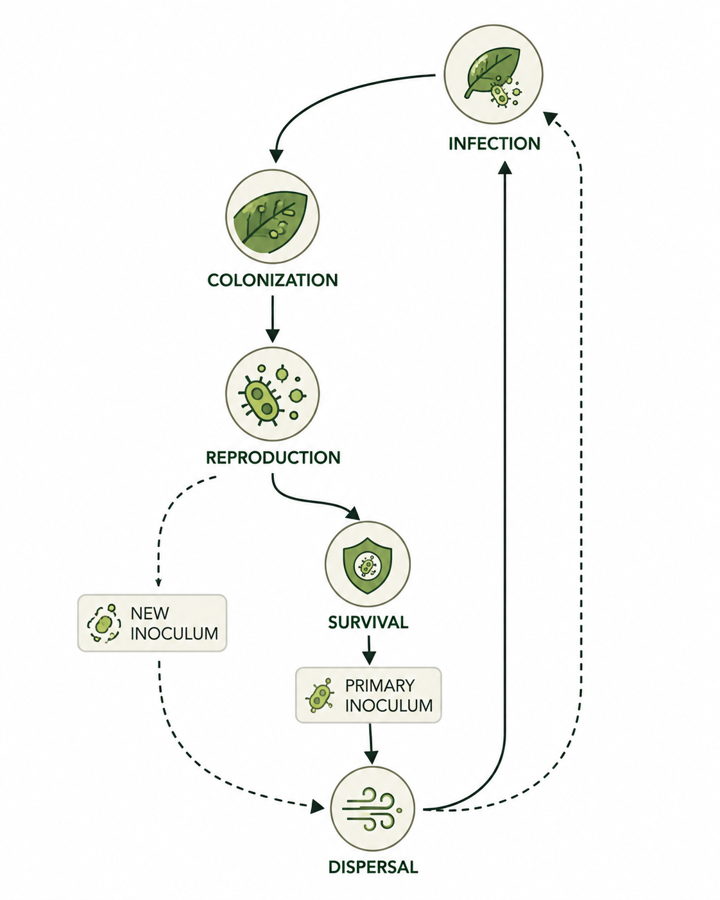
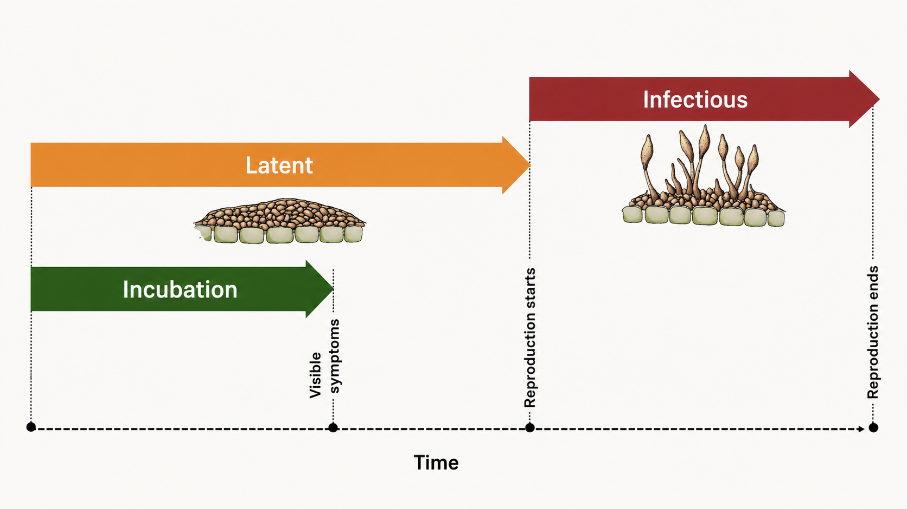
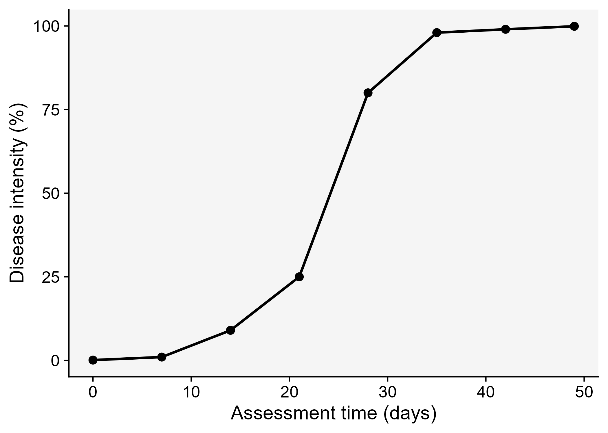
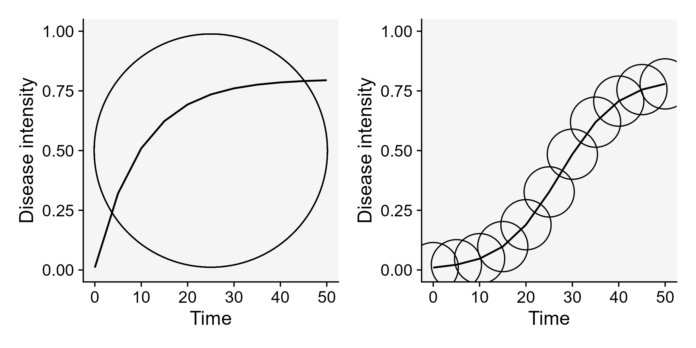
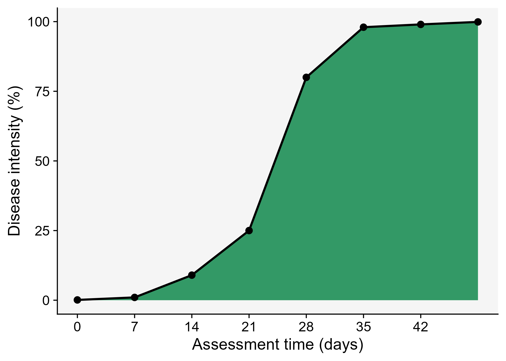
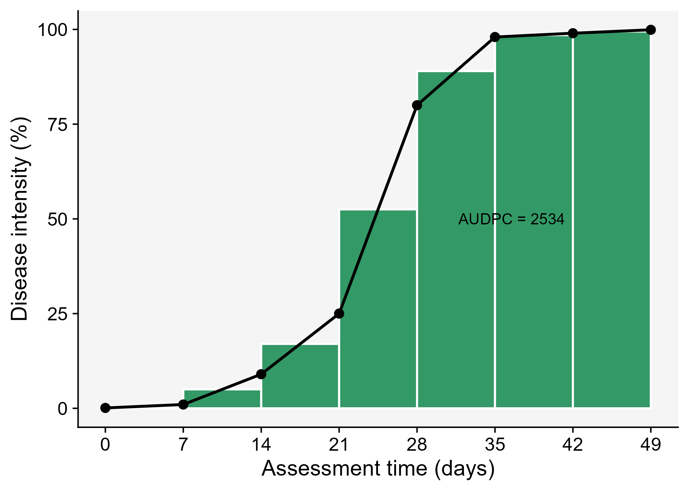

# Disease progress curves

## How epidemics occur

Before knowing how epidemics develop in time, it is important to understand how an epidemic occur. An epidemic begins when the **primary inoculum** (a variable number of propagules able to infect the plant) that is *surviving* somewhere establishes an intimate contact with individuals of the host population - this process is called *infection*. These inocula are usually surviving externally to the plant host and need to *disperse* (move), passively or by means of a vector, to reach the plant. It can also be that a growing host encounter a localized (static) source of inoculum.

Once the infection is established, the pathogen *colonizes* the plant tissues and disease symptoms are noticed. When this happens, the **incubation period** can be measured in time units. A successful colonization will lead to *reproduction* of the pathogen inside and/or external to the crop, and so the **latent period** is completed, and can also be measure in time units. Finally, the **infectious period** takes place and continues until the pathogen is not capable of producing the **secondary inoculum** on the infected site.

{#fig-diagram width="490"}

Epidemiologists are generally interested in determining the length of the incubation, latent, and infectious periods as influenced by factors related to the host, pathogen, or environment. This is relevant because the longer it takes for the completion of the incubation and latent periods, the lower the potential number of repeated cycles. In summary, a single "infection cycle" represents all events that occur from infection to dispersal, and this occurs only once for many diseases, while for others there may be multiple cycles, which are defined as an "infection chain."

{#fig-periods fig-align="center"}

## Disease curves

A key understanding of the epidemics relates to the knowledge of rates and patterns. Epidemics can be viewed as dynamic systems that change their state as time goes. The first and simplest way to characterize such changes in time is to produce a graphical plot called disease progress curve (DPC). This curve can be obtained as long as the intensity of the disease (*y*) in the host population is assessed sequentially in time (*t*).

A DPC summarizes the interaction of the three main components of the disease triangle occurring during the epidemic. The curves can vary greatly in shape according to variations in each of the components, in particular due to management practices that alter the course of the epidemics and for which the goal is to stop disease increase. We can create a data frame in R for a single DPC and make a plot using ggplot. By convention we use `t` for time and `y` for disease intensity, expressed in percentage (0 to 100%).

Firstly, let's load the essential R packages and set up the environment.

```{r}
#| warning: false
#| message: false
library(tidyverse) # essential packages 
theme_set(theme_r4pde()) # set global theme
```

There are several ways to create a data frame in R. I like to use the `tribble` function as below. The entered data will be assigned to a dataframe called `dpc`.

```{r}
dpc <- 
  tribble(
   ~t,  ~y, 
   0,  0.1, 
   7,  1, 
  14,  9, 
  21,  25, 
  28,  80, 
  35, 98, 
  42, 99, 
  49, 99.9
  )
```

Now the plot

```{r}
#| message: false
dpc1 <- dpc |>
  ggplot(aes(t, y)) +
  theme_r4pde()+
  geom_line(size = 1)+
  geom_point(size = 3, shape = 16)+
  labs(x = "Assessment time (days)",
       y = "Disease intensity (%)")

ggsave("imgs/dpc1.png", dpc1)
```

{#fig-dpc1}

## Epidemic classification

Vanderplank analysed the shapes of great number of epidemic curves and classified the epidemics into two basic types: monocyclic or polycyclic [@plantdi1963]. In **monocyclic** epidemics, inoculum capable of infecting the crop is not produced during the epidemics. These epidemics are initiated and maintained only by the primary inoculum. There is no secondary infection and hence no further spread of newly produced inoculum among the host individuals. Tipically, the progress curves for monocyclic epidemics have a saturation type shape. An example of a monocyclic epidemic is the disease known as wheat smut caused by *Tilletia caries*. In this disease, although two types of spores are produced during a single cycle (teliospores and basidiospores), no additional infection cycles occur within the same growing season.

Conversely, when the secondary inoculum produced during the epidemics is capable of infecting the host during the same crop cycle, a **polycyclic** epidemic is established. The number of repeated cycles just depends on how long it takes to complete a single infection cycle. These epidemics most commonly present a sigmoid shape @fig-cycles. An example of a polycyclic epidemic is soybean rust as it undergoes repeated infection cycles with uredospores on soybean.

```{r}
#| warning: false
#| message: false
#| code-fold: true

library(tidyverse)
theme_set(theme_bw(base_size = 16))

library(epifitter)
polyc <- sim_logistic(N = 50, dt = 5, 
                      y0 = 0.01, r = 0.2, 
                      K = 0.8, n = 1, 
                      alpha =0)

p <- polyc |> 
  ggplot(aes(time, y))+
  geom_point(aes(time, y), size =19, shape =1)+
  geom_line()+
  ylim(0,1)+
  theme_r4pde()+
  labs(x = "Time", y = "Disease intensity")


monoc <- sim_monomolecular(N = 50, dt = 5, 
                           y0 = 0.01, r = 0.1,
                           K = 0.8, n = 1, 
                           alpha =0)
library(ggforce)
m <- monoc |> 
  ggplot(aes(time, y))+
  geom_point(aes(x = 25, y = 0.5), size =90, shape = 1)+
   geom_line()+
 theme_r4pde()+
  ylim(0,1)+
  labs(x = "Time", y = "Disease intensity")

library(patchwork)
cycles <- m | p
ggsave("imgs/cycles.png", bg = "white", width = 8, height =4)
```

{#fig-cycles fig-align="center"}

## Curve descriptors and AUDPC

The depiction and analysis of disease progress curves can provide useful information for gaining understanding of the underlying epidemic process. The curves are extensively used to evaluate how disease control measures affect epidemics. When characterizing DPCs, a researcher may be interested in describing and comparing epidemics that result from different treatments, or simply in their variations as affected by changes in environment, host or pathogen.

The precision and complexity of the analysis of progress curve data depends on the objective of the study. In general, the goal is to synthesize similarities and differences among epidemics based on common descriptors of the disease progress curves. For example, the simple appraisal of the disease intensity at any time during the course of the epidemic should be sufficient for certain situations. Furthermore, a few quantitative and qualitative descriptors can be extracted including:

-   Epidemic duration
-   Maximum disease
-   Curve shape
-   Area under the area under the disease progress curve (AUDPC).

Let's visualize the AUDPC in the same plot that we produced above.

```{r}
#| message: false

dpc2 <- dpc |>
  ggplot(aes(t, y)) +
  labs(x = "Assessment time (days)",
       y = "Disease intensity (%)")+
    geom_area(fill = "#339966")+
    geom_line(linewidth = 1)+
  theme_r4pde()+
  geom_point(size = 3, shape = 16)+
  scale_x_continuous(breaks = c(0, 7, 14, 21, 28, 35, 42))
ggsave("imgs/dpc2.png")

```

{#fig-audpc2 fig-align="center"}

The AUDPC summarizes the "total measure of disease stress" and is largely used to compare epidemics [@jeger2001]. The most common approach to calculate AUDPC is the trapezoidal method, which splits the disease progress curves into a series of rectangles, calculating the area of each of them and then summing the areas. Let's extend the plot code to show those rectangles using the `annotate` function.

```{r}
#| message: false
#| code-fold: true
dpc3 <- dpc |>
  ggplot(aes(t, y)) +
  theme_r4pde()+
  labs(x = "Assessment time (days)",
       y = "Disease intensity (%)")+
  annotate("rect", xmin = dpc$t[1], xmax = dpc$t[2], 
           ymin = 0, ymax = (dpc$y[1]+ dpc$y[2])/2, 
           color = "white", fill = "#339966")+
   annotate("rect", xmin = dpc$t[2], xmax = dpc$t[3], 
            ymin = 0, ymax = (dpc$y[2]+ dpc$y[3])/2, 
            color = "white", fill = "#339966")+
   annotate("rect", xmin = dpc$t[3], xmax = dpc$t[4], 
            ymin = 0, ymax = (dpc$y[3]+ dpc$y[4])/2,
            color = "white", fill = "#339966")+
   annotate("rect", xmin = dpc$t[4], xmax = dpc$t[5], 
            ymin = 0, ymax = (dpc$y[4]+ dpc$y[5])/2, 
            color = "white", fill = "#339966")+
   annotate("rect", xmin = dpc$t[5], xmax = dpc$t[6], 
            ymin = 0, ymax = (dpc$y[5]+ dpc$y[6])/2, 
            color = "white",fill = "#339966")+
   annotate("rect", xmin = dpc$t[6], xmax = dpc$t[7], 
            ymin = 0, ymax = (dpc$y[6]+ dpc$y[7])/2, 
            color = "white", fill = "#339966")+
  annotate("rect", xmin = dpc$t[7], xmax = dpc$t[8], 
            ymin = 0, ymax = (dpc$y[7]+ dpc$y[8])/2, 
            color = "white", fill = "#339966")+
  geom_line(linewidth = 1)+
  geom_point(size = 3, shape = 16)+
  annotate(geom = "text", x = 36.5, y = 50,
           label = "AUDPC = 2534" , size = 4)+
  scale_x_continuous(breaks = c(0, 7, 14, 21, 28, 35, 42, 49))
ggsave("imgs/dpc3.png")

  
```

{#fig-dpc3 fig-align="center"}

In R, we can obtain the AUDPC for the DPC we created earlier using the `AUDPC` function offered by the *epifitter* package. Because we are using the percent data, we need to set the argument `y_proportion = FALSE`. The function returns the absolute AUDPC. If one is interested in relative AUDPC, the argument `type` should be set to `"relative"`. There is also the alternative to AUDPC, the area under the disease progress stairs (AUDPS) [@simko2012].

```{r}
library(epifitter)
AUDPC(dpc$t, dpc$y, 
      y_proportion = FALSE)

# The relative AUDPC 
AUDPC(dpc$t, dpc$y, 
      y_proportion = FALSE, 
      type = "relative")

# To calculate AUDPS, the alternative to AUDPC
AUDPS(dpc$t, dpc$y, 
      y_proportion = FALSE)
```

## Functional comparison of curves

The AUDPC is useful when the objective is to reduce an epidemic to one number. However, two epidemics may have similar AUDPC values and still differ in timing, shape, or the period when disease increases most rapidly. A more direct way to compare whole disease progress curves is to treat each curve as a function of time. This is the idea behind the `functional_curves()` and `functional_distances()` functions in the *r4pde* package.

The `functional_curves()` function fits a smooth disease progress curve for each treatment using a generalized additive model (GAM). The fitted curves are then predicted over a common time grid. The `functional_distances()` function compares these predicted functions by calculating the distance between each pair of curves across the entire time interval. For two fitted curves, $f_1(t)$ and $f_2(t)$, the distance is based on the integrated squared difference between them:

$$
d(f_1, f_2) = \sqrt{\int \{f_1(t) - f_2(t)\}^2 dt}
$$

Because disease progress data are observed at discrete times, the function uses predictions on a regular grid and approximates the integral numerically. In practical terms, the distance increases when two curves are far apart for a long period of time, and decreases when the curves remain close to each other.

The example below creates two hypothetical epidemics with nearly identical AUDPC values but very different shapes. The first epidemic increases earlier and reaches a moderate plateau. The second epidemic remains low for a longer period but then increases sharply and reaches a higher final intensity. If only the AUDPC is used, these two epidemics appear almost equivalent; if the full curves are compared, their temporal patterns are clearly different.

```{r}
#| warning: false
#| message: false
#| code-fold: true

dpc_functional <- tidyr::crossing(
  treatment = c("Early plateau", "Late surge"),
  unit_id = 1:4,
  t = seq(0, 49, 7)
) |>
  mutate(
    y = case_when(
      treatment == "Early plateau" ~ 0.70 * plogis(-3 + 0.24 * t),
      treatment == "Late surge" ~ plogis(-8.5 + 0.36 * t)
    )
  )

audpc_functional <- dpc_functional |>
  distinct(treatment, t, y) |>
  group_by(treatment) |>
  summarise(
    audpc = epifitter::AUDPC(t, y, y_proportion = TRUE),
    .groups = "drop"
  )

curves_fit <- functional_curves(
  data = dpc_functional,
  time = "t",
  response = "y",
  treatment = "treatment",
  response_scale = "proportion",
  min_points = 5,
  grid_n = 120,
  family_try = "quasibinomial",
  show_progress = FALSE
)

audpc_functional

curve_dist <- functional_distances(
  curves_fit,
  cluster_k = 2,
  show_progress = FALSE
)

curve_dist$distance_table
```

The figure first shows that the two epidemics have the same AUDPC even though their shapes differ. The lower panels show how the functional distance is built. The two fitted curves are compared at every point in the prediction grid. The vertical segments represent local differences between the curves. The shaded region emphasizes the separation accumulated over time. The final distance is the square root of the summed squared differences, scaled by the spacing of the time grid.

```{r}
#| warning: false
#| message: false
#| code-fold: true

distance_curves <- curves_fit$curves |>
  tidyr::pivot_wider(
    names_from = treatment,
    values_from = mu
  ) |>
  mutate(
    ymin = pmin(`Early plateau`, `Late surge`),
    ymax = pmax(`Early plateau`, `Late surge`),
    squared_difference = (`Early plateau` - `Late surge`)^2
  )

distance_lines <- distance_curves |>
  slice(round(seq(1, n(), length.out = 12)))

distance_value <- curve_dist$distance_table$distance[1]

audpc_labels <- audpc_functional |>
  mutate(
    t = 26,
    y = 0.08,
    label = paste0("AUDPC = ", round(audpc, 2))
  )

p_same_audpc <- dpc_functional |>
  distinct(treatment, t, y) |>
  ggplot(aes(t, y, color = treatment, fill = treatment)) +
  geom_area(alpha = 0.22, color = NA) +
  geom_line(linewidth = 1) +
  geom_point(size = 2) +
  geom_label(
    data = audpc_labels,
    aes(t, y, label = label),
    inherit.aes = FALSE,
    size = 3.2,
    fill = "white"
  ) +
  facet_wrap(~ treatment, nrow = 1) +
  scale_y_continuous(labels = scales::percent, limits = c(0, 1)) +
  labs(
    x = "Assessment time (days)",
    y = "Disease intensity"
  ) +
  theme_r4pde(font_size = 12) +
  theme(
    legend.position = "none",
    strip.background = element_blank(),
    strip.text = element_text(face = "bold")
  )

p_distance_curves <- curves_fit$curves |>
  ggplot(aes(t, mu, color = treatment)) +
  geom_ribbon(
    data = distance_curves,
    aes(x = t, ymin = ymin, ymax = ymax),
    inherit.aes = FALSE,
    fill = "#D9A441",
    alpha = 0.30
  ) +
  geom_segment(
    data = distance_lines,
    aes(x = t, xend = t, y = ymin, yend = ymax),
    inherit.aes = FALSE,
    color = "gray35",
    linewidth = 0.5
  ) +
  geom_point(
    data = dpc_functional,
    aes(t, y, color = treatment),
    alpha = 0.45,
    size = 1.8
  ) +
  geom_line(linewidth = 1.1) +
  annotate(
    "label",
    x = 34,
    y = 0.16,
    label = paste0("Functional distance = ", round(distance_value, 2)),
    size = 3.5,
    fill = "white"
  ) +
  scale_y_continuous(labels = scales::percent, limits = c(0, 1)) +
  labs(
    x = "Assessment time (days)",
    y = "Disease intensity",
    color = "Treatment"
  ) +
  theme_r4pde(font_size = 12) +
  theme(legend.position = "bottom")

p_squared_difference <- distance_curves |>
  ggplot(aes(t, squared_difference)) +
  geom_area(fill = "#339966", alpha = 0.65) +
  geom_line(color = "gray60", linewidth = 0.8) +
  labs(
    x = "Assessment time (days)",
    y = "Squared difference"
  ) +
  theme_r4pde(font_size = 12)

library(patchwork)
functional_distance_plot <- p_same_audpc / p_distance_curves / p_squared_difference +
  plot_layout(heights = c(1.2, 1.6, 1))

ggsave(
  "imgs/functional-distance.png",
  functional_distance_plot,
  width = 7,
  height = 8,
  bg = "white"
)
```

{#fig-functional-distance fig-align="center"}

The same approach can be extended to many treatments or genotypes. In that case, `functional_distances()` returns a full distance matrix, a pairwise distance table, and clusters of curves with similar epidemic patterns. These outputs are useful when the interest is not only whether one treatment has less disease, but also whether the entire temporal pattern of the epidemic is different.
